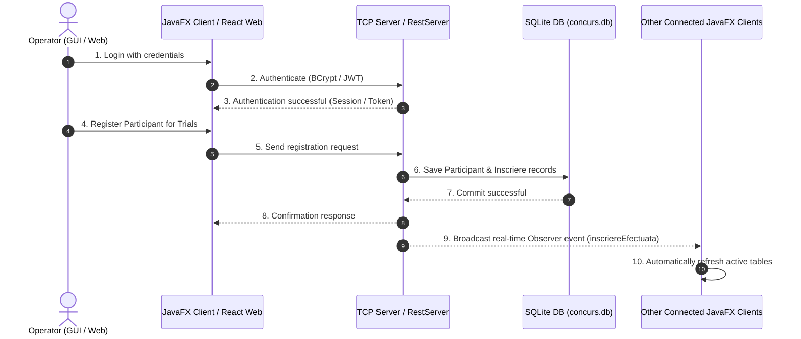

# Competition Management System 🏊‍♂️🎨

**Competition Management System** is a multi-module client-server and web application built in **Java** and **React** designed for managing children's competition events (sports & artistic trials), participant registrations, and age categories in real-time. 

The application offers dual client interfaces — a **JavaFX Desktop GUI** connecting via custom **TCP Socket JSON RPC** with real-time push notifications, and a modern **React 19 Web Client** communicating with a **Spring Boot REST API** secured via **JWT** and **Spring Security**.

---

## What the App Does

* **Operator Authentication**: Secure login/logout for competition organizers using password hashing (**BCrypt**) and JWT tokens.
* **Competition Events & Categories**: View, create, update, delete, and filter competition trials (`Proba`) by age category (e.g., 6–8 years, 9–11 years, 12–15 years).
* **Participant Registration**: Register competitors with details (name, CNP, age) into multiple competition events simultaneously.
* **Real-Time Client Synchronization**: Instant UI notifications and dynamic table refresh across all active JavaFX desktop clients using TCP socket observer notifications when a new registration occurs.
* **RESTful API & Web Client**: Full CRUD management of events via Spring Boot REST controllers, complete with JWT authorization header handling and a responsive React single-page application.
* **Java REST Client**: Console test client utilizing Spring 6 `RestClient` with request logging interceptors to interact with the REST API.

---

## Project Structure

```text
Lab13
├── Model/               # Domain entities (Operator, Participant, Proba, Inscriere)
├── Services/            # Service contracts & interfaces (IServices, IObserver, InscriereException)
├── Persistence/         # Data Access Layer (JDBC Direct SQL repos & Hibernate/JPA ORM repos)
├── Networking/          # Socket JSON RPC Protocol & Concurrent Server infrastructure
├── Server/              # Multi-threaded TCP RPC Server with Observer notification dispatcher
├── Client/              # JavaFX Desktop GUI Client (Real-time TCP Socket RPC client)
├── RestServer/          # Spring Boot REST API Server with JWT & Spring Security
├── JavaClient/          # Spring RestClient test application for consuming REST endpoints
└── client-web/          # Modern React 19 + Vite Web Application SPA
```

---

## Key Concepts & Technologies

### 1. Multi-Module Architecture (Gradle)
The project is split into 9 decoupled Gradle modules, ensuring strict separation of concerns:
* **`Model`**: Shared data transfer entities (`Operator`, `Participant`, `Proba`, `Inscriere`).
* **`Services`**: Service interfaces separating UI/Networking from business logic.
* **`Persistence`**: Handles database interactions independently of the upper layers.
* **`Networking`**: Encapsulates socket serialization, DTOs, and RPC request handlers.
* **`Server`**: Host server executing business logic and observer dispatches.
* **`Client`**: JavaFX desktop frontend.
* **`RestServer`**: Independent Spring Boot REST application.
* **`JavaClient`**: REST client application.
* **`client-web`**: React web frontend.

---

### 2. Dual Persistence Layer (JDBC & Hibernate ORM)
The persistence layer supports two distinct data access approaches against an **SQLite** database (`concurs.db`):
* **JDBC Direct Repositories**: (`OperatorDBRepo`, `ParticipantDBRepo`, `ProbaDBRepo`, `InscriereDBRepo`) — direct SQL queries using raw JDBC for maximum control and performance.
* **Hibernate / JPA Repositories**: (`ParticipantHibernateRepo`, `ProbaHibernateRepo`) — ORM mapping using annotations (`@Entity`, `@Table`, `@Id`, `@GeneratedValue`) managed via a centralized `HibernateUtils` session manager.

---

### 3. Real-Time Socket Networking & Observer Pattern
* **Custom JSON Protocol**: Communication between `Client` and `Server` uses JSON request/response packets (`Request`, `Response`, `RequestType`) over raw TCP Sockets.
* **Concurrent Server**: `AbstractConcurrentServer` & `JsonConcurrentServer` spin up non-blocking worker threads (`ClientJsonWorker`) for each connected desktop client.
* **Observer Pattern**: When an operator registers a participant, the server broadcasts an `IObserver.inscriereEfectuata()` notification to all active TCP connections, automatically triggering a live refresh on all open desktop client views.

---

### 4. Spring Boot REST API & JWT Security
* **Endpoints (`RestServer`)**:
  * `POST /auth/login` — Authenticates credentials and issues a JWT token.
  * `GET /probe` — Retrieves all events (optional `?categorie=...` query parameter for filtering).
  * `GET /probe/{id}` — Finds a specific event by ID.
  * `POST /probe` — Adds a new event (returns `201 Created`).
  * `PUT /probe/{id}` — Updates an existing event details.
  * `DELETE /probe/{id}` — Deletes an event (returns `204 No Content`).
* **Spring Security & JWT**: Request authorization filter (`JwtFilter`) parses `Authorization: Bearer <token>` headers using `JwtUtil`.

---

### 5. React 19 & Vite Web Client (`client-web`)
* Single Page Application (SPA) constructed with **React 19** and **Vite**.
* Features modular UI components:
  * `ProbaTable`: Interactive table listing competition events.
  * `ProbaForm`: Modal for adding/updating events.
  * `FilterBar`: Category selector for live client-side or API filtering.
  * `Login`: Modal form for user authentication.
  * `Toast`: Feedback messages for HTTP operations.

---

### 6. JavaFX Desktop GUI Client (`Client`)
* Desktop UI built with **JavaFX 17**, **FXML**, **ControlsFX**, and **BootstrapFX**.
* Implements MVC with controllers (`LoginController`, `MainController`).
* Displays live event lists, registered participant counts, and multi-select event registration forms.

---

### 7. Java REST Client (`JavaClient`)
* Console application demonstrating consumption of the REST API using Spring 6 `RestClient`.
* Configured with a `LoggingInterceptor` to output HTTP requests, headers, and payload trace logs for debugging.

---

## Data Models & Database Schema

| Class / Table | Description |
| :--- | :--- |
| **`Operator`** | Stores organizer credentials (`username`, BCrypt `passwordHash`). |
| **`Participant`** | Competitor profile (`nume`, `cnp`, `varsta`). |
| **`Proba`** | Competition event (`nume` e.g. *50m liber*, `categorieVarsta` e.g. *6-8 ani*). |
| **`Inscriere`** | Junction entity mapping a `Participant` to a `Proba`. |

### Database Schema (`concurs.db`)

```text
operators               participants             probe
─────────────────       ────────────────────     ────────────────────────
id (PK)                 id (PK)                  id (PK)
username                nume                     nume
password                cnp                      categorieVarsta
                        varsta

                        inscrieri
                        ────────────────────────
                        id (PK)
                        participantId (FK → participants)
                        probaId (FK → probe)
```

---

## How a Typical Flow Works



---

## Libraries & Dependencies

| Library / Tool | Purpose |
| :--- | :--- |
| **Java 17 & 21** | Core runtime environment |
| **Spring Boot 3.2** | Framework for REST Server (`RestServer`) |
| **Spring Security & JJWT** | Authentication & JWT token handling |
| **Hibernate 6 / JPA** | Object-Relational Mapping (ORM) persistence |
| **SQLite JDBC** | Lightweight relational database driver |
| **JavaFX 17** | GUI framework for the desktop client |
| **React 19 & Vite** | SPA framework and dev server for web client |
| **BCrypt (`jbcrypt`)** | Password hashing algorithm |
| **Jackson** | JSON serialization / deserialization |
| **Log4j2 & SLF4J** | Application logging framework |
| **JUnit 5** | Automated unit testing framework |

---

## Getting Started

### Prerequisites
* **JDK 17** or higher
* **Node.js** (v18+) & **npm** (for `client-web`)
* **Gradle** (or use the included `./gradlew` wrapper)

### 1. Build the Backend Projects
```bash
./gradlew build
```

### 2. Run the Multi-Threaded TCP RPC Server
```bash
./gradlew :Server:run
```

### 3. Launch the JavaFX Desktop Client
```bash
./gradlew :Client:run
```

### 4. Run the Spring Boot REST Server
```bash
./gradlew :RestServer:bootRun
```
*The REST server will start on `http://localhost:8080`.*

### 5. Launch the React Web Client
```bash
cd client-web
npm install
npm run dev
```
*Open `http://localhost:5173` in your web browser.*

### 6. Run the Java REST Test Client
```bash
./gradlew :JavaClient:run
```
